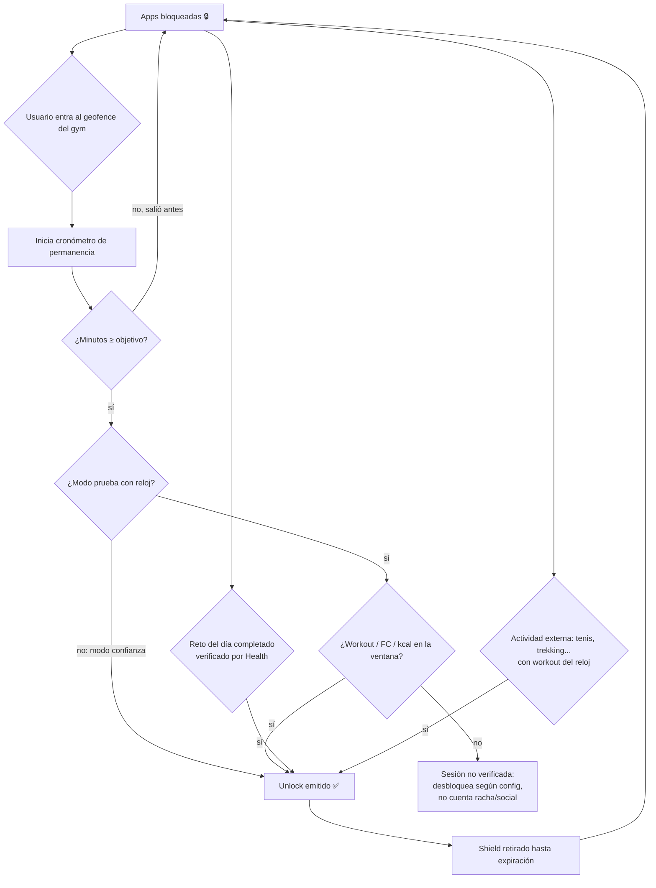

# SUDA — Entrena para desbloquear

> Plan maestro del producto: app móvil que bloquea redes sociales / apps adictivas y solo las desbloquea cuando entrenas de verdad (gym verificado por ubicación + reloj/dispositivo de salud), con capa social opcional.

**Estado:** Documento fundacional v1 · Agosto 2026
**Autor:** Ivan (product owner) + Claude (planificación)

---

## 1. Nombre

### Recomendación principal: **SUDA**

- "Suda" = imperativo de sudar en español. Corto, pronunciable en cualquier idioma, agresivo y memorable.
- Tagline natural: **"Suda para desbloquear"** / EN: **"Sweat to unlock"**.
- Funciona como verbo dentro del producto: *"te faltan 20 min de suda"*, *"racha de suda: 12 días"*.
- Handles probables: `@suda.app`, `sudaapp.com`, `getsuda.com` (verificar disponibilidad de dominio y marca antes de comprometerse).

### Alternativas (shortlist)

| Nombre | Idea | Pros | Contras |
|---|---|---|---|
| **GymLock** | Descriptivo puro | Se entiende en 1 segundo | Genérico, difícil de registrar como marca |
| **Earnit** | "Gánatelo": el scroll se gana | Concepto potente, global | Ya existen productos con nombres similares |
| **Repz** | Reps del gym | Gen-Z, corto | No comunica el bloqueo |
| **Forge** | Te forjas antes de consumir | Premium, aspiracional | Muy usado en fitness |
| **Candado** | El candado del gym que cierra tus apps | Bilingüe-friendly, visual (ícono obvio) | Largo en inglés (Padlock) |

**Decisión sugerida:** avanzar con **SUDA** como nombre de trabajo; validar marca/dominio en paralelo. Todo este documento usa SUDA como nombre provisional.

---

## 2. Visión y propuesta de valor

**Problema:** la gente pierde 3–5 h/día en redes sociales y a la vez "no tiene tiempo" para entrenar. Las apps de bloqueo existentes (Brick, one sec, Opal) bloquean, pero el desbloqueo es arbitrario (tocar un NFC, esperar un timer). No exigen nada valioso a cambio.

**Propuesta:** SUDA convierte el tiempo de pantalla en una **recompensa que se gana entrenando**. Tus apps bloqueadas se abren solo cuando:

1. Estuviste físicamente en tu gym el tiempo mínimo configurado (≥ 15 min, default 45 min), **verificado por ubicación**, y/o
2. Completaste **el reto del día**, y/o
3. Registraste una actividad deportiva (trekking, tenis, baloncesto…) **verificada por tu reloj / dispositivo de salud**.

**Diferenciadores vs Brick:**

| | Brick | SUDA |
|---|---|---|
| Desbloqueo | Tocar el brick físico (NFC) | Entrenamiento real verificado |
| Hardware | Requiere comprar el brick | Ninguno (el "brick" es tu gym) |
| Verificación | Ninguna (el brick está en tu casa) | GPS + geofence + datos biométricos del reloj |
| Social | No | Red social opcional: rachas, retos, comparativa tiempo-gym vs tiempo-scroll |
| Datos de salud | No | Apple Watch / Wear OS / Health Connect: calorías, minutos de ejercicio, FC |

**North star metric:** minutos de entrenamiento verificado por usuario activo semanal.

---

## 3. Realidad técnica primero (leer antes de nada)

Estas son las restricciones duras de plataforma que definen todo el diseño. Ser honestos aquí evita construir algo que Apple/Google rechacen.

### 3.1 Bloqueo de apps

**iOS — Screen Time API (la única vía legítima, la misma que usa Brick):**
- Frameworks: `FamilyControls` + `ManagedSettings` + `DeviceActivity`.
- El usuario autoriza a SUDA como app de control; elige qué apps/categorías/sitios web bloquear con `FamilyActivityPicker` (Apple no nos deja ver *cuáles* son — son tokens opacos, bueno para privacidad).
- `ManagedSettingsStore.shield` aplica el bloqueo; podemos personalizar la pantalla de escudo ("Te faltan 23 min de gym para desbloquear").
- **Requiere el entitlement `com.apple.developer.family-controls` para distribución**: hay que solicitarlo a Apple con justificación. Brick, Opal y one sec lo tienen; el caso de uso "bienestar digital" es aprobable, pero es un trámite con semanas de espera → **pedirlo en la semana 1 del proyecto**.
- Bloqueo de sitios web: `ManagedSettings` cubre Safari; para otros navegadores se bloquea el navegador como app.

**Android:**
- Detección de app en primer plano: `UsageStatsManager` (permiso `PACKAGE_USAGE_STATS`, el usuario lo activa en Ajustes).
- Bloqueo: overlay a pantalla completa sobre la app bloqueada (`SYSTEM_ALERT_WINDOW`) + `AccessibilityService` como detector instantáneo (declarando el uso correctamente para pasar la review de Google Play — política de Accessibility API exige justificación de accesibilidad/bienestar; las apps de digital wellbeing la obtienen con el formulario de "permitted use").
- Bloqueo de sitios web: `AccessibilityService` leyendo la barra de URL de los navegadores principales, o un VPN local con filtrado DNS (más robusto, más fricción de permisos). MVP: método accessibility; v2: VPN local opcional.

### 3.2 "Que no se pueda desinstalar" — la verdad

**Ninguna plataforma permite que una app de consumo sea imposible de desinstalar.** Brick tampoco lo es: su fuerza es que desbloquear exige el objeto físico. Lo que sí podemos construir (y es lo que hace la categoría):

- **iOS:**
  - Mientras el shield de Screen Time está activo, podemos **bloquear también los Ajustes y la App Store** en "Modo estricto", lo que en la práctica impide desinstalar SUDA o revocar el permiso sin cumplir el entrenamiento.
  - Guía al usuario para activar en Ajustes → Tiempo en pantalla → "No permitir eliminar apps" (restricción del sistema, opcional, la activa él).
- **Android:**
  - Detectar el intento de abrir Ajustes/desinstalación con el `AccessibilityService` y cubrirlo con el overlay del "Modo estricto".
  - `Device Admin` para dificultar la desinstalación está desaconsejado/deprecated para consumo por Google Play → no lo usamos.
- **Diseño de producto (la barrera real):**
  - **Modo estricto por compromiso:** al activarlo, el usuario fija una duración (1 día – 4 semanas) durante la cual no puede desactivar el bloqueo ni pausarlo. Salida de emergencia: 1–3 "llaves de emergencia" al mes (como Brick) con cooldown de 24 h y notificación a tus amigos si compartes socialmente ("Ivan usó una llave de emergencia 👀" — presión social opcional).
  - **Fricción de escape:** desactivar fuera de plazo exige esperar 24 h + confirmaciones espaciadas ("cooling-off period"), nunca un botón inmediato.

**Mensaje de marketing honesto:** "tan difícil de saltar como Brick, sin comprar hardware" — no prometer "imposible de desinstalar".

### 3.3 Verificación de gym por ubicación

- **Geofencing:** el usuario marca su(s) gym(s) en el mapa (o los detectamos vía Places API). Radio 75–150 m.
- iOS: `CLLocationManager` region monitoring + visitas (`CLVisit`) — bajo consumo, funciona en background con permiso "Siempre".
- Android: `GeofencingClient` + `ActivityRecognition`.
- **Cronómetro de permanencia:** entrada al geofence inicia sesión; se acumulan minutos mientras permanece dentro. Salidas < 5 min (baño, agua, llamada) no cortan la sesión.
- **Mínimo configurable:** 15 min (piso duro) — default 45 min — máximo libre.

### 3.4 Anti-trampa (crítico para que el producto tenga sentido)

Sin esto, dejas el teléfono en el gym o vives al lado de uno y ya. Capas:

1. **Ubicación + permanencia** (base).
2. **Cross-check biométrico (el candado real):** si hay reloj/banda conectada, exigir que durante la ventana de gym exista **una sesión de entrenamiento o señales de esfuerzo** (FC elevada sostenida, calorías activas, minutos de ejercicio). Configurable por el usuario: "modo confianza" (solo ubicación) vs "modo prueba" (ubicación + biometría). Los retos y actividades fuera del gym **siempre** exigen biometría (ver 3.5).
3. **Detección de mock location** (Android: `isFromMockProvider`; iOS: integridad vía App Attest / DeviceCheck).
4. **Sanity checks:** teleports imposibles, sesiones de gym a las 3 AM repetidas, sesiones con el teléfono 0 pasos/0 movimiento (CoreMotion / Activity Recognition) → marcar como "no verificada" (desbloquea igual en modo confianza, pero no cuenta para rachas/social).

### 3.5 Actividades fuera del gym (trekking, tenis, baloncesto…)

Tal como intuyes: la ubicación no basta (una cancha no es un geofence fiable, un sendero menos). Regla de producto:

> **Actividad fuera del gym = válida solo con workout registrado en el dispositivo de salud.**

- iOS: HealthKit → `HKWorkout` con tipo (`.tennis`, `.basketball`, `.hiking`, `.running`, +80 tipos), duración, calorías activas y FC. El Apple Watch detecta y registra la mayoría automáticamente.
- Android: **Health Connect** (estándar actual) → `ExerciseSessionRecord` con tipo de ejercicio, + registros de FC/calorías. Compatible con Samsung Health, Fitbit, Garmin (vía sus sincronizaciones a Health Connect), Wear OS.
- Garmin/Polar/otros sin Health Connect: integración directa con sus APIs en v2; en MVP, "si sincroniza a Apple Health / Health Connect, funciona".
- Validación: duración ≥ mínimo del usuario, FC media > umbral personalizado (o calorías activas > umbral), timestamp reciente (< 3 h) para evitar reciclar entrenamientos viejos.

### 3.6 El reto del día

Desbloqueo alternativo para días sin gym:
- Un reto diario servido por el backend: "7.000 pasos antes de las 6 PM", "20 min de caminata continua", "quema 300 kcal activas", "45 min de cualquier workout".
- Verificación: pasos/calorías/workouts de HealthKit / Health Connect (no autoreporte).
- Dificultad ajustada al historial del usuario (progresiva, estilo Duolingo).
- El usuario elige en ajustes si el reto del día puede sustituir al gym, complementarlo, o estar desactivado.

---

## 4. Funcionalidades (spec por versión)

### 4.1 MVP (v1.0) — "el candado que funciona"

**Onboarding**
1. Explicación del modelo (entrenas → desbloqueas) con pantallas claras.
2. Permisos guiados uno a uno con el porqué: Screen Time / Usage Access, ubicación "Siempre", notificaciones, Salud (opcional pero recomendado).
3. Selección de apps/sitios a bloquear (FamilyActivityPicker en iOS; lista de apps instaladas en Android + lista de dominios).
4. Marcar gym(s) en el mapa; elegir minutos requeridos (15/30/45/60/custom); elegir cuánto tiempo de apps desbloquea cada sesión (p. ej. "1 sesión de gym = resto del día" o "= 2 h de apps" — configurable).
5. Elegir modo: **Confianza** (solo ubicación) / **Prueba** (ubicación + reloj).

**Núcleo de bloqueo**
- Bloqueo por horario (opcional: "bloqueadas siempre" vs "bloqueadas de 7 AM a 10 PM").
- Pantalla de escudo motivacional con progreso: "🔒 Instagram — te faltan 23 min en el gym".
- Estado de desbloqueo: al validar la sesión → notificación "💪 Desbloqueado hasta las 11 PM" (o el tiempo elegido).
- Modo estricto con duración de compromiso + llaves de emergencia (3/mes).
- Día de descanso configurable (1–2/semana, se programa con 24 h de antelación para que no sea un escape impulsivo).

**Gym & actividades**
- Geofencing multi-gym, cronómetro de permanencia, tolerancia a salidas cortas.
- Import de workouts desde HealthKit / Health Connect (todas las actividades soportadas por la plataforma).
- Reto del día (5–6 plantillas de reto, rotación diaria).

**Estadísticas personales**
- Tiempo en apps bloqueadas (antes/después de SUDA) vs tiempo entrenado — el gráfico insignia del producto: **"scroll vs sweat"**.
- Racha de días cumplidos, minutos de gym semanales, calorías activas.

**Cuenta y backend**
- Registro con Apple/Google Sign-In (email opcional).
- Sync de configuración y estadísticas (para el social y para restaurar en reinstalación — clave: si desinstalan y reinstalan, la racha y el modo estricto se restauran y la reinstalación queda registrada).

### 4.2 v1.5 — capa social

- Perfil público opcional (opt-in explícito, privado por defecto).
- Compartir: racha, minutos de gym/semana, ratio scroll-vs-sweat, retos completados. **Nunca** se comparte qué apps bloqueas ni tu ubicación/gym exactos (solo "fue al gym", jamás cuál ni dónde).
- Amigos, feed de actividad ("Sofía completó el reto del día 🔥", "Ivan lleva 21 días de racha").
- Grupos/crews: retos semanales de grupo ("el crew suma 500 min de gym esta semana"), leaderboard entre amigos.
- Presión social del modo estricto: notificar a tu crew si rompes racha o usas llave de emergencia (opt-in).
- Reacciones/ánimos (👏🔥💪), sin comentarios libres en v1.5 (menos moderación).

### 4.3 v2.0 — profundidad

- Integraciones directas: Garmin, Polar, Whoop, Fitbit API, Strava (importar actividades como fuente de verificación).
- Retos personalizados creados por el usuario o el crew.
- Detección automática de gym nuevo (visitas recurrentes a un lugar categorizado como gym → "¿este es tu gym?").
- Modo dueño-de-gym / partnerships: gimnasios verificados con check-in por QR/NFC del gym como capa extra de verificación (y canal de adquisición B2B).
- Widget / Live Activity (iOS) con progreso del día en la pantalla de bloqueo.
- Bloqueo web por VPN local en Android.
- Coach de retos con dificultad adaptativa real (basada en historial).

---

## 5. Arquitectura técnica

### 5.1 Decisión de stack: **nativo en ambas plataformas**

Todo el corazón del producto (Screen Time API, DeviceActivity extensions, AccessibilityService, geofencing en background, HealthKit/Health Connect) es API nativa profunda que Flutter/React Native solo alcanzan con módulos nativos custom — acabaríamos escribiendo el 70 % del código nativo igualmente, con una capa extra de fricción. Además las extensions de iOS (Shield UI, DeviceActivityMonitor) corren fuera del proceso principal y no pueden ser Flutter/RN.

- **iOS:** Swift + SwiftUI. Targets: app + `DeviceActivityMonitor` extension + `ShieldConfiguration` extension + `ShieldAction` extension.
- **Android:** Kotlin + Jetpack Compose. Componentes: `AccessibilityService`, `ForegroundService` para sesiones de gym, `BroadcastReceiver` de geofence, WorkManager para syncs.
- **Compartido:** todo el negocio que se pueda vive en el backend; los clientes son finos en lógica y gruesos en integración de plataforma.

### 5.2 Backend

- **Recomendación MVP: Supabase** (Postgres + Auth + Realtime + Edge Functions) — velocidad de desarrollo, coste bajo, y es Postgres estándar → sin lock-in grave si hay que migrar a infra propia en v2.
- Edge Functions para: validación de sesiones de gym (reglas anti-trampa server-side), generación del reto del día, feed social.
- Push: APNs + FCM.
- Analytics de producto: PostHog (self-hostable, privacy-friendly).

### 5.3 Modelo de datos (núcleo)

```
users(id, auth_provider, handle, created_at, settings_json)
gyms(id, user_id, name_alias, lat, lng, radius_m)            -- coords nunca expuestas socialmente
block_profiles(id, user_id, platform, schedule_json, strict_until, emergency_keys_left)
gym_sessions(id, user_id, gym_id, entered_at, exited_at, verified_minutes,
             verification level: location_only | biometric, status)
workouts(id, user_id, source, type, started_at, minutes, active_kcal, avg_hr, raw_ref)
daily_challenges(id, date, template_id, params_json)
challenge_completions(id, user_id, challenge_id, evidence_json, completed_at)
unlocks(id, user_id, granted_by: gym|challenge|activity|emergency_key, granted_at, expires_at)
screen_time_reports(id, user_id, date, blocked_minutes, by_category_json)   -- agregado, opt-in
friendships(user_id, friend_id, status)
crews(id, name), crew_members(crew_id, user_id)
feed_events(id, user_id, type, payload_json, visibility, created_at)
```

**Regla de oro del desbloqueo (server-side cuando hay red, con fallback offline firmado):**
el cliente pide desbloqueo presentando evidencia (sesión de geofence + opcionalmente workout); el backend valida y emite un `unlock` con expiración; el cliente aplica/retira el shield según los `unlocks` vigentes. **Fallback sin conexión:** la validación corre también en el dispositivo con las mismas reglas (el gym suele tener mala señal); al recuperar red se reconcilia y, si la evidencia no pasa la validación server, afecta rachas/social pero no revoca el desbloqueo ya disfrutado (no castigar por bugs de red).

### 5.4 Diagrama de flujo del desbloqueo



### 5.5 Privacidad y cumplimiento (no negociable)

- **Ubicación:** se procesa en el dispositivo; al backend solo van eventos derivados ("sesión de gym de 47 min"), nunca tracks GPS continuos. Coordenadas de gyms cifradas y jamás visibles a otros usuarios.
- **Salud:** datos de HealthKit **no pueden** usarse para publicidad ni compartirse (regla dura de App Store 5.1.3); mismo espíritu con Health Connect. Solo se sube el agregado necesario para validar/estadísticas, con opt-in.
- **Social:** todo opt-in, privado por defecto, granular (puedo compartir racha pero no minutos).
- GDPR/LOPD: export y borrado de cuenta self-service desde el día 1.
- Menores: 13+ (o 16 según región); sin features sociales para menores en MVP.

---

## 6. Riesgos principales y mitigación

| Riesgo | Impacto | Mitigación |
|---|---|---|
| Apple no concede el entitlement Family Controls | Bloqueante en iOS | Solicitarlo semana 1; caso de uso "digital wellbeing" tiene precedente (Opal, Brick, one sec); plan B: lanzar Android primero |
| Google Play rechaza el uso de AccessibilityService | Bloqueante del bloqueo en Android | Formulario de uso permitido (digital wellbeing es categoría aceptada); plan B: solo overlay + UsageStats (menos instantáneo pero viable) |
| Geofencing impreciso (gyms en centros comerciales, sótanos) | Falsos negativos → frustración | Radio ajustable, botón "estoy en el gym" que inicia sesión manual pero exige biometría para validar, aprendizaje del lugar |
| Trampas (dejar el móvil en el gym, mock location) | El producto pierde credibilidad social | Capa biométrica, detección de mock/motion, rachas solo con sesiones verificadas |
| Battery drain por ubicación background | Desinstalaciones | Region monitoring (no GPS continuo), `CLVisit`, significant-change |
| Expectativa "no desinstalable" no cumplida al 100 % | Decepción | Mensaje honesto: modo estricto + fricción, igual que Brick sin hardware |

---

## 7. Modelo de negocio

- **Freemium.**
  - Gratis: bloqueo básico, 1 gym, modo confianza, retos del día, estadísticas de 7 días.
  - **SUDA Pro (~4,99 US$/mes o 39,99/año):** modo estricto largo, multi-gym, modo prueba biométrico, crews y retos de grupo, historial completo, widgets.
- Sin publicidad jamás (contradice la misión y las reglas de datos de salud la prohíben con estos datos).
- v2: B2B gimnasios (retención de socios: "tus socios vienen más si su Instagram depende de ello") — canal de partnership y adquisición.

---

## 8. Roadmap y estimación

Equipo asumido: 1 dev iOS, 1 dev Android, 1 backend/fullstack (o 2 personas fuertes multi-rol), diseño por contrato.

| Fase | Duración | Entregable |
|---|---|---|
| 0. Fundación | 2 sem | Solicitud entitlement Apple + formulario Play, diseño UX de onboarding y shield, setup Supabase, spike técnico de Screen Time y AccessibilityService |
| 1. Candado | 6 sem | Bloqueo funcionando en ambas plataformas + geofencing + cronómetro + unlock por gym (modo confianza) |
| 2. Verificación | 4 sem | HealthKit/Health Connect, modo prueba, actividades externas, reto del día, anti-trampa v1 |
| 3. Beta cerrada | 4 sem | TestFlight/Internal testing con 50–100 usuarios, telemetría, pulir batería y falsos negativos de geofence |
| 4. Lanzamiento v1.0 | 2 sem | App Store + Play Store, landing, onboarding pulido |
| 5. Social v1.5 | 6 sem | Perfiles, amigos, feed, crews, retos de grupo |

**Total a v1.0 pública: ~4,5 meses. Social: +1,5 meses.**

### Primeros 5 pasos concretos (esta semana)

1. Verificar disponibilidad de marca/dominio de **SUDA** (y plan B de la shortlist).
2. Crear cuenta Apple Developer y **solicitar el entitlement Family Controls** (el trámite más largo de todo el proyecto).
3. Crear cuenta Google Play Console y revisar el formulario de declaración de AccessibilityService.
4. Spike técnico iOS: proyecto mínimo que bloquea 1 app con shield custom y la desbloquea por código.
5. Spike técnico Android: geofence + cronómetro de permanencia + overlay de bloqueo sobre Instagram.

---

## 9. Preguntas abiertas (decidir con datos de la beta)

- ¿Cuánto desbloquea una sesión de gym por defecto: el resto del día o un presupuesto de horas? (hipótesis: presupuesto de 2 h re-engancha mejor el hábito).
- ¿El reto del día puede sustituir al gym siempre, o máximo 2 veces/semana? (riesgo: que nadie vaya al gym).
- ¿Llaves de emergencia: 1 o 3 al mes?
- ¿Streak freeze (congelar racha) como feature Pro o va contra la filosofía?
